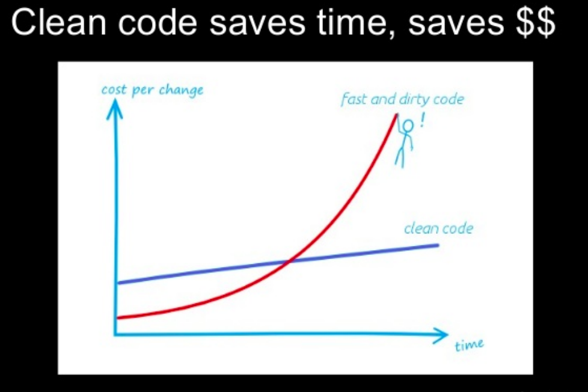
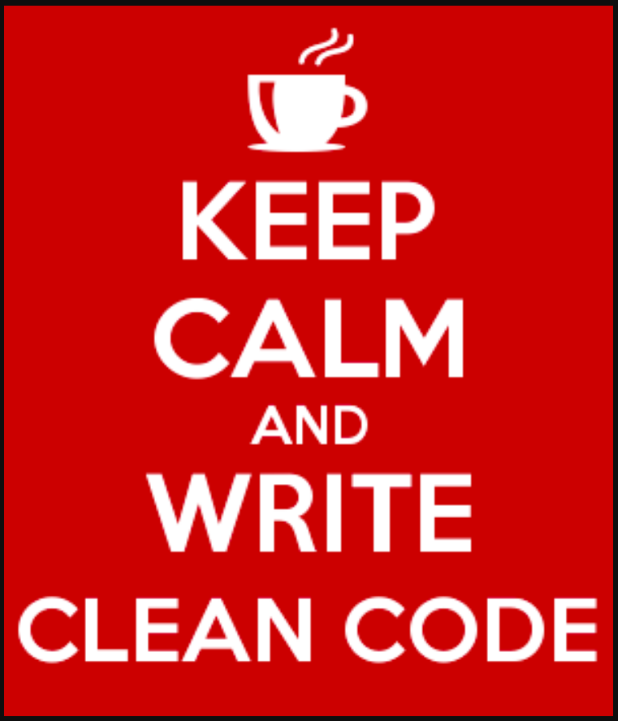

I know, I know... clean code and stuff are important...

But deadline is on Friday... what do I do..!?

We rush through. And create bugs along the way.

That cost more time and money in the long run!

---

so..,

