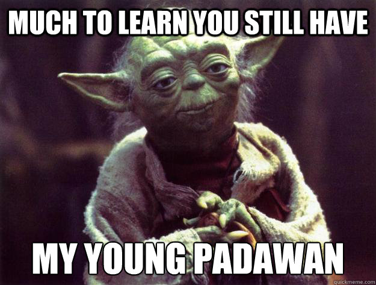

##Yoda

### General Idea

* Typos are part of your daily workflow.  

* Problems arise though when the typo is proper syntax and neither the IDE nor interpreter alert you to it.

* Unexpected behavior will happen if it is not fixed.

* Yoda condition is a programming style which helps to prevent such kind of errors.

* Purpose and intent to catch an assignment when you mean to do a comparison.

### Bad Practice?

Yoda conditions may make code harder to read for some developers. Part of your job as a software professional is to write quality code. You want your code to be as readable as possible.
Take the time to learn when to apply this anti pattern.