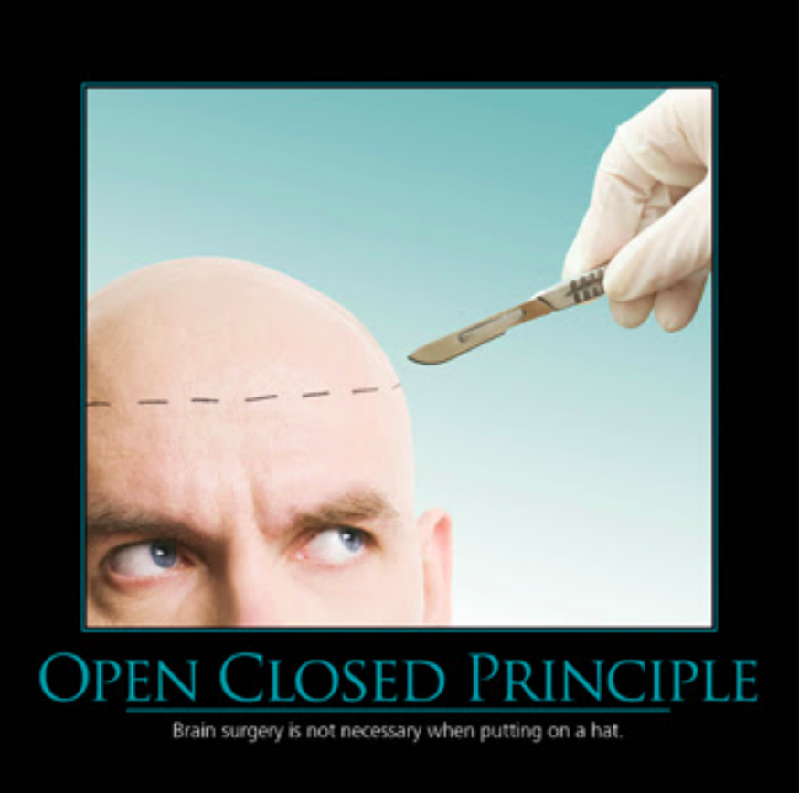

# Open-Close Principle

## "Entities(class, method, function) should be open for extension, but closed for modifications"

* Open for extension means that it should be simple to change the behavior of a class.
* Closed for modification means:
  * Change the behavior of a class without modifying source code
  * And you do it through extension.
* Uncle Bob says: *“Separate extensible behaviour behind an interface and flip the dependencies.”*
  * Code to an interface
* This is a goal. It’s very difficult to follow perfectly. But it’s something you strive for.