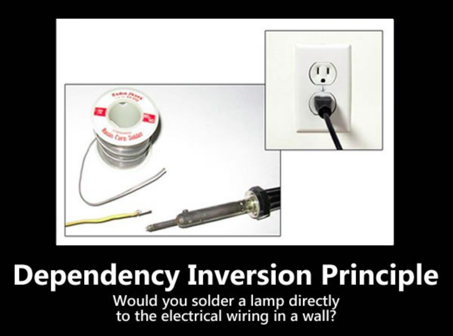

# Dependency Inversion Principle

---

## "Depend on abstractions, not on concretions."

* First thing's first: It's **not** the same as dependency injection!
   * Dependency Injection enables Dependency Insertion.
* What this means is,
   * **"High level modules should not depend upon low level modules. Instead they should depend upon abstractions."**
   * **"Low level modules too should depend upon abstractions."**
* High level code **isn’t** concerned with the specific details.
* Low level code **is** more concerned with details and specifics.
* All of this allows for decoupling.

