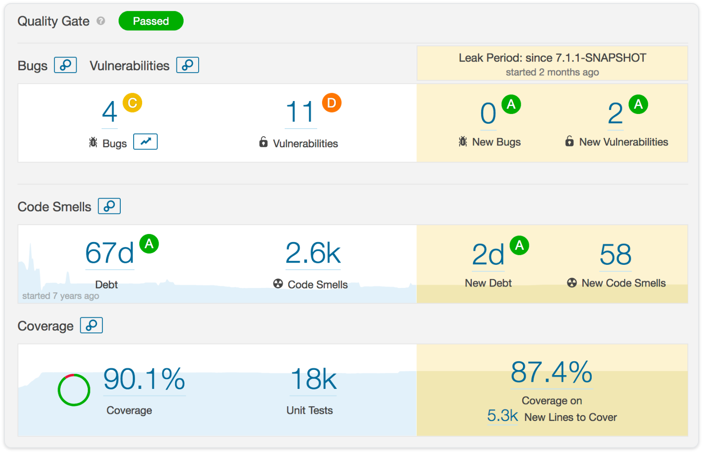
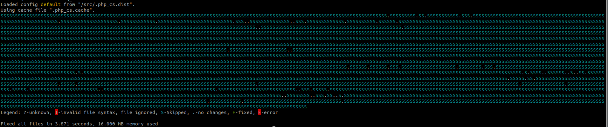
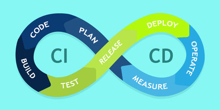
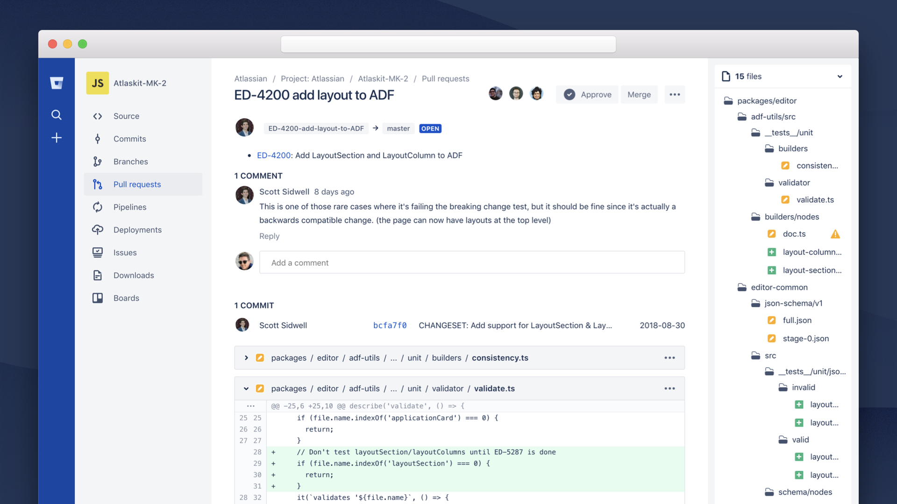

## Tools

- [SonarQube](https://www.sonarqube.org/)

- CS Fixers
    - [php-cs-fixer](https://github.com/FriendsOfPHP/PHP-CS-Fixer), [JCSC](http://jcsc.sourceforge.net/), [JLint](http://artho.com/jlint/), [IDE](https://www.jetbrains.com/products.html) (PHPStorm)

- CI / CD

- Code Reviews

### Speaker Notes
- SonarQube
    - It's an open-source code quality inspection tool.
    - It can  perform automatic reviews with static analysis of code to detect bugs, code smells, and security vulnerabilities.
- CS Fixers
    - PHP Coding Standards Fixer.
    - PHP coding standards as defined in the PSR-1, PSR-2, etc.
- CI / CD
    - You can use Jenkins, Travis CI, etc.
    - Using Pipelines SonarQube and CS fixers can easily integrate with Jenkins.

- Code Reviews
    - Bitbucket
    - GitHub