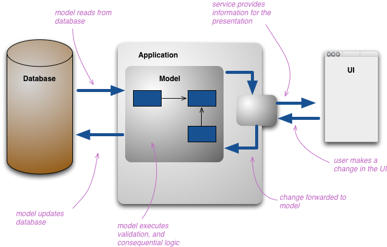
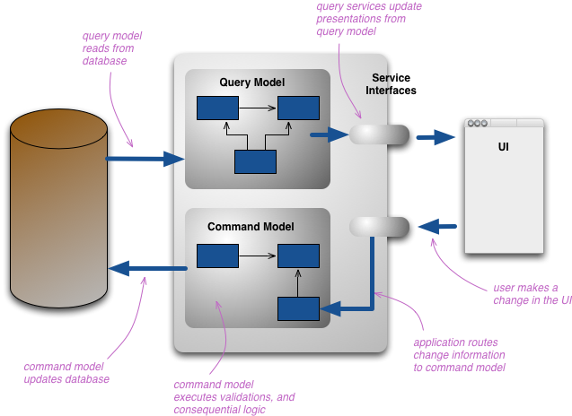

# CQRS - Command Query Responsibility Segregation

### What? 
It states that every method should either be a command that performs an action, or a query that returns data to the caller, but **not both**.

 
 

**Traditional way**

 
 

**CQRS**

 
 

### When?
CQRS is not suitable for small applications that do not require a high degree of scalability and that do not have complex domain logic, and for applications that have a direct impact on life or health.

 
 

### Why?
  * Maintainability
  * Scalability
  * Easy to implement event sourcing and DDD

 
 

### How?