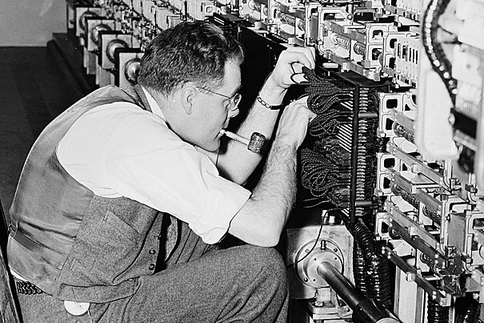
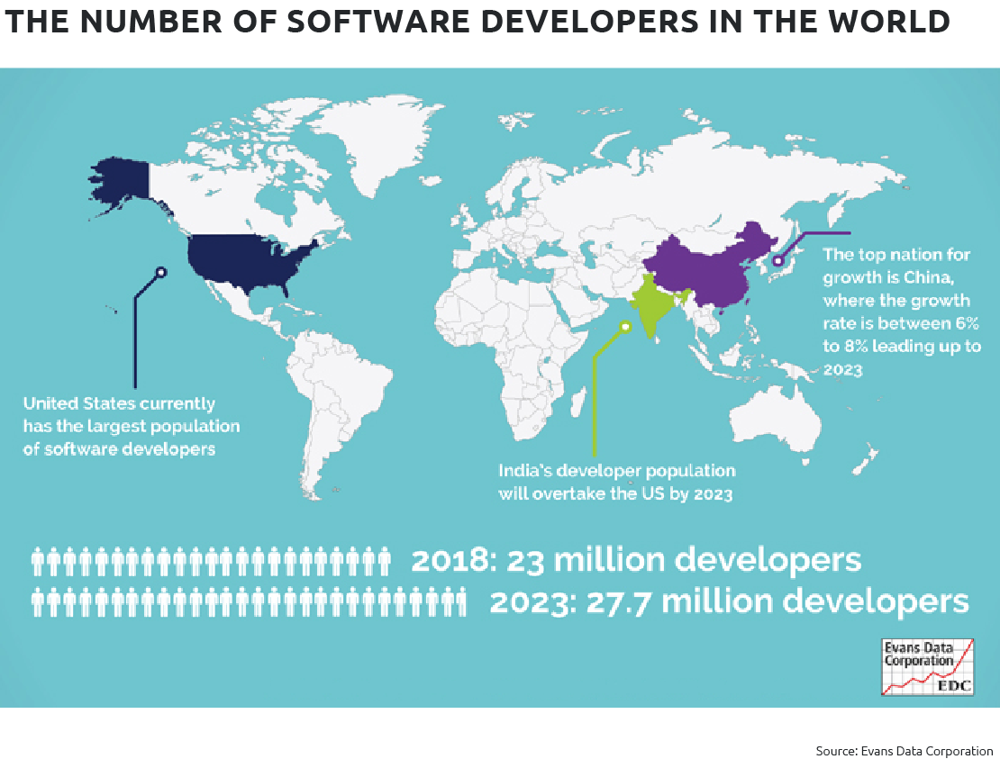

# Mentorship

### Alan Turing

### Today

* Number of programmers in the world double in every 5 years
* Half of programmers don't hav 5 years of experience
* As Experienced programmers pass down the knowledge
* As Freshers, seek and ask for guidance