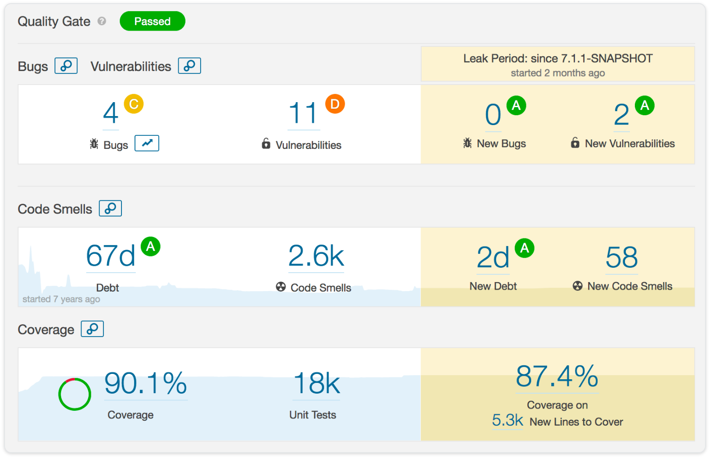
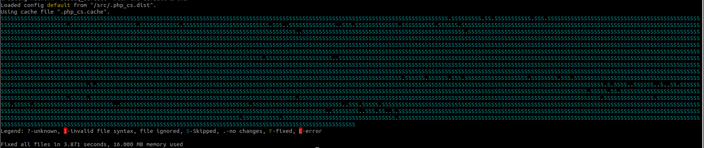
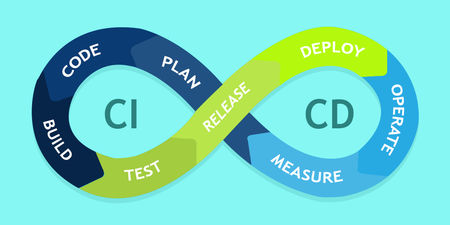
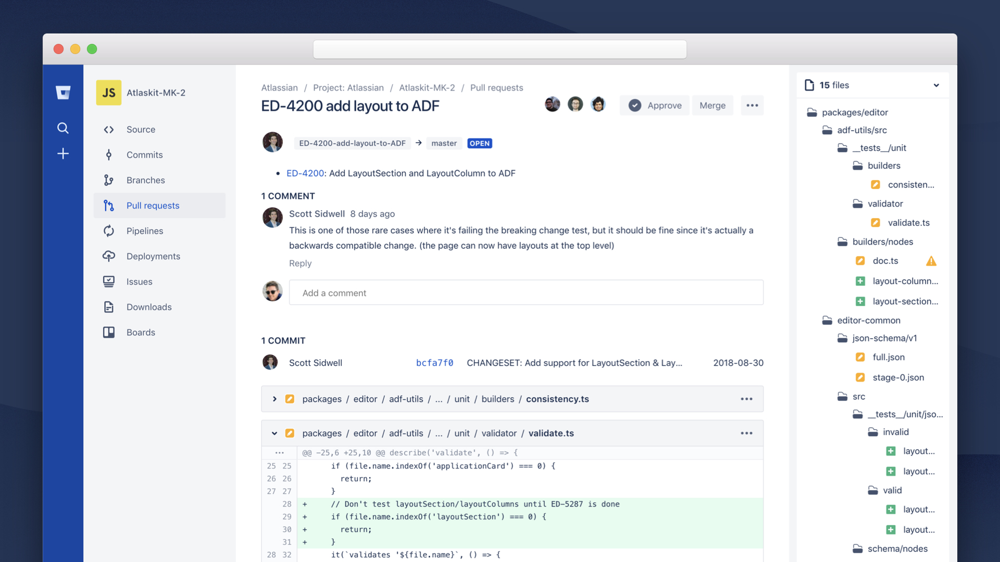

## Tools

- Sonarqube

- CS fixers
    php-cs-fixer, JCSC, JSLint, PhpStorm

- CI/CD

- Code Reviews

### Speaker Notes
- Sonarqube
    - It's an open-source code quality inspection tool.
    - It can  perform automatic reviews with static analysis of code to detect bugs, code smells, and security vulnerabilities.
- CS fixers
    - PHP Coding Standards Fixer.
    - PHP coding standards as defined in the PSR-1, PSR-2, etc.
- CI/CD
    - You can use Jenkins.
    - Using Pipelines SonarQube and CS fixers can easily integrate with Jenkins.

- Code Reviews
    - Bitbucket
    - GitHub