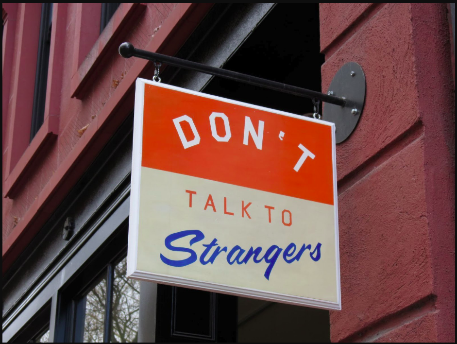

# Law of Demeter (LoD)



* LoD is a more of a guideline than a law/principle to help **reduce coupling** between components

* Problem: Train Wrecks!
```php
    $obj->getX()
        ->getY()
        ->getZ()
        ->doSomething();
```

* LoD tells us is a bad idea for single functions to know the entire navigation structure of the system.
  * `$obj` knows that it has an `X`, `X` has a `Y`, `Y` has a `Z` and that `Z` can `doSomething()`

* Solution: Tell! Don't ask.
```php
    $obj->doSomething();
```

---

> “Each unit should have only limited knowledge about other units: only units “closely” related to the current unit. Each unit should only **talk to its friends; don’t talk to strangers.**”

    You may call methods of objects that are:
    1. Passed as arguments
    2. Created locally
    3. Instance variables
    4. Globals

* Exception case: for simple DTO's it's okay to chain methods as they don't have any behaviour associated.
---

* Biological systems are an example of such systems. 
  * Cells don’t ask each other questions, they tell each other what to do. 
  * We are an example of a Tell Don’t Ask system, and within us the Law of Demeter prevails.